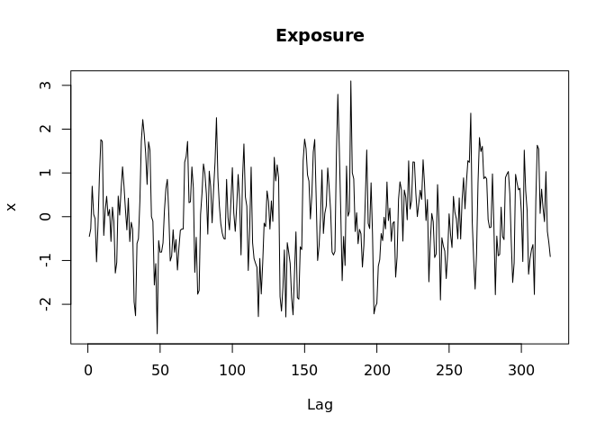
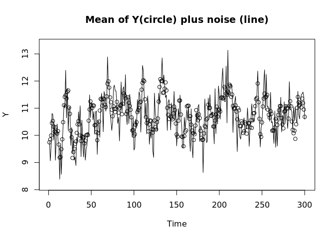
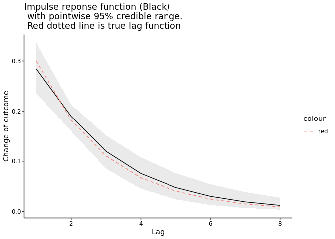

#### Dynamic linar model with transfer function (1,0) to capture monotonic lag decay, including time-varying intercept, stochastic level

Use rstan for inference Hiroshi Mamiya July/2021

------------------------------------------------------------------------

``` r
require(rstan)
require(ggplot2)

options(mc.cores=parallel::detectCores())

rm(list=ls())
set.seed(1)
```

------------------------------------------------------------------------

#### Generate a single realization of time-series, stochastic level and koyck lag

``` r
# Numer of observations (time points)
Tn <- 300

# Lag coefficient
lambda <- 0.5 

# Immediate effect 
beta = 0.3

# Observation noise, standard deviation of error for Y 
sigma_Y <- 0.5

# Standard deviation of shift in intercept 
sigma_alphaLevel <- 0.1


# Intercept, e.g.  log store-level sales of junk food, alpha_1 (initial value) is log(10)
alpha <- cumsum(rnorm(n = Tn, sd = sigma_alphaLevel)) + 10
plot(alpha, main = "Intercept, random walk without trend", type = "l", xlab = "Time")
```


``` r
# Lag function of exposure  
H <- 0:20 # lag horizen 
lagFunction <- (beta*exp(-(1-lambda)*H))
plot(lagFunction, main = "A monotonic decay \n e.g., advertising-sales or heatwave-mortality association", type = "l", xlab = c("Lag"))
```


``` r
# Exposure, ar(1) - centered and scaled
x <- arima.sim(model = list(ar = 0.6), n = Tn+max(H), sd = 0.1)
x <- scale(x)[,1]
plot(x, main = "Exposure", type = "l", xlab = c("Lag"))
```



``` r
# Create lag 
# Function to generate matrix of exposure with lag, borrowed from : https://github.com/alastairrushworth/badlm/blob/master/R/lag_matrix.R
lag_matrix  <-  function (rain, p, start.at.zero = T){
  slider <- function(n) rev(rain[n:(n + p - !start.at.zero)])
  nums <- as.list(1:(length(rain) - p))
  matrix(unlist(lapply(nums, slider)), nrow = (length(rain) - p), ncol = p + start.at.zero, byrow = TRUE)
}

lag_mat       <- lag_matrix(x, p = max(H))


# Generate outcome, combination of lagged effect of x, intercept and noise 
yMean    <- as.numeric(lag_mat %*% lagFunction) + alpha
# Add noise
y <- yMean + rnorm(Tn, mean = 0, sd = sigma_Y)


plot(yMean, ylab = c("Y"), xlab = "Time"); 
lines(y, type = "l"); 
title(main = "Mean of Y(circle) plus noise (line)")
```



``` r
# Input variables to stan
T <- Tn # Time variable, not boolian 
x <- x[-H] # Trim lag horizon


# Final note: actual koyck lag can be simulated as follows: 
#beta = psi/(1-lambda) # Observed outcome, log sales quantity
#y <- rep(NA,T) # Outcome
#mu <- rep(NA,T) # Mean component of outcome variable consisting of unobserved state vector 
#epsilon <- rep(NA,T); # Difference between observation and state i.e. [y - mu] for each time 
# Initialize 
#epsilon[1] <- 0
#mu[1] <-  alpha[1] + beta*(1-lambda)*x[1]
#y[1] <- rnorm(1,mu[1],sigma_Y)

# Generate observations
#for (t in 2:Tn){
#  mu[t] <- lambda*y[t-1] + (1-lambda)*alpha[t] + beta*(1-lambda)*x[t] - lambda*epsilon[t-1] 
#  y[t] <- rnorm(1, mu[t], sigma_Y)
#  epsilon[t] <- y[t] - mu[t]
#}
```

#### Fitting stan models

#### Compile results

``` r
### Generate Impuse response function from fit 
post <- rstan::extract(fit3, pars =  c("beta", "lambda"), permuted = TRUE, inc_warmup = FALSE)
betaPosterior = post[[1]]; lambdaPosterior = post[[2]]
h <- 8
# IRF, mean, lower and uppfer CI 
irfWeight <- data.frame(weekLag = 1:h, lo = rep(NA, h), median = rep(NA, h),  hi = rep(NA, h))
# Time t
irfWeight[1, ] <- c(1, quantile(betaPosterior , c(0.025)), median(betaPosterior), quantile(betaPosterior , c(0.975)))
# time t+(2:h)
for(i in 2:h){irfWeight[i, ] <- c(i, quantile(beta * {lambdaPosterior^(i-1)}, c(0.025, 0.5,0.975)))} 

# Plot Impulse response function 
irfWeight$lagTrue <-  lagFunction[1:h] 
  
scaleFUN <- function(x) sprintf("%.1f", x)
p <-  ggplot(data = irfWeight, aes(x=(weekLag), y=median)) + 
  geom_line() + 
  theme_classic() +
  xlab("Lag") + ylab("Change of outcome") + 
  geom_ribbon(aes(ymin=lo, ymax=hi), linetype=2, alpha=0.1)  + 
  scale_y_continuous(labels=scaleFUN) + 
  theme(axis.text = element_text(color = "black")) + 
  ggtitle("Impulse reponse function (Black) and pointwise 95% credible range.")

# Add the true lag function 
p + geom_line(aes(y = lagTrue, colour = "red"), linetype="dashed")
```



``` r
# Posteior fit check, comparison of fitted and unobserved (true) value 
 params <- rstan::extract(fit3, pars = "yHat")
 median <- apply(params$yHat, 2, median)
 lo <- apply(params$yHat, 2, quantile, 0.025)
 hi <- apply(params$yHat, 2, quantile, 0.975)
 plot(lo, type = "l", lty = "dotted", ylim = range(c(median, lo, hi)), ylab = expression(Y[t]), xlab = "Time")
 points(y, pch = 3, cex = 0.5, col = "blue")
 lines(hi, lty = "dotted")
 lines(median, type = "l", lwd = 1)
 title(main = "Predictive distribution of and observed Y \n Fitted mean:solid line, 95% credible interval: dotted line, overved Y: cross ")
```


